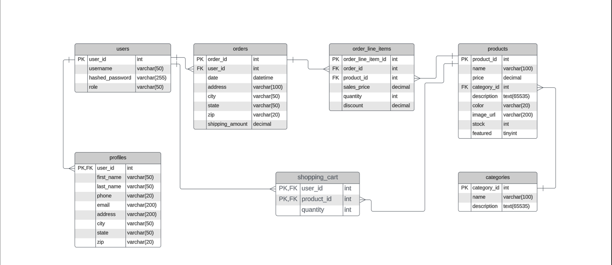

# EasyShop-SpringBoot-Upgrade
This repository contains the backend API for the EasyShop e-commerce application. As part of Version 2 development, this project focuses on enhancing the existing Spring Boot-based backend server. 

Key responsibilities include:

	•	Debugging and resolving issues in the current API codebase.
	•	Implementing improvements and optimizations for API endpoints.
	•	Maintaining the MySQL database structure and ensuring data integrity.
	•	Integrating and testing the API with the provided frontend project using Postman.

# Features

## Existing Features:
	•	User authentication and authorization with roles (admin, user).
	•	Product catalog with categories, pricing, descriptions, and stock tracking.
	•	Shopping cart functionality.
	•	Order creation and management, including shipping details.

## Bugs:
The current API contains functional bugs. Your tasks include:
1.	Debugging and resolving issues in the existing codebase.
2.	Writing unit tests to validate the fixes.

## Folder Structure
       src
		└── main
			└── java
			└── org.yearup
			├── configurations
			│   └── DatabaseConfig.java
			├── controllers
			│   ├── AuthenticationController.java
			│   ├── CategoriesController.java
			│   ├── ProductsController.java
			│   ├── ProfileController.java
			│   └── ShoppingCartController.java
			├── data
			│   ├── mysql
			│   │   ├── MySqlCategoryDao.java
			│   │   ├── MySqlDaoBase.java
			│   │   ├── MySqlProductDao.java
			│   │   ├── MySqlProfileDao.java
			│   │   └── MySqlUserDao.java
			│   ├── CategoryDao.java
			│   ├── ProductDao.java
			│   ├── ProfileDao.java
			│   └── ShoppingCartDao.java
			├── models
			│   ├── authentication
			│   │   ├── Category.java
			│   │   ├── Product.java
			│   │   ├── Profile.java
			│   │   ├── ShoppingCart.java
			│   │   └── ShoppingCartItem.java
			│   └── security
			└── EasyShopApplication.java
			test
			└── java
			└── org.yearup
			└── configuration
			└── TestDatabaseConfig.java
			resources

## Project Setup

## Prerequisites:
	•	Java 17
	•	Spring Boot 2.x
	•	MySQL 8.x
	•	Postman for API testing
	•	Git for version control

## Database Setup:
	1.	Open the create_database.sql file from the /database folder in MySQL Workbench.
	2.	Execute the script to create the easyshop database.
	3.	The database contains several preloaded products and three sample users:

	••	Username: user, admin, george/n
	••	Password: password

- Refer to the provided ERD diagram for the database structure.

## Application Structure

### Backend:
•	Controller Layer: Handles API endpoints.
•	Service Layer: Contains business logic.
•	Repository Layer: Interfaces with the MySQL database.

### Database Schema:

The database consists of the following tables:

	•	users (user authentication)
	•	profiles (user profile details)
	•	products (product catalog)
	•	categories (product categories)
	•	orders and order_line_items (order management)
	•	shopping_cart (shopping cart functionality)

#### Usage

	1.	Clone the repository into your development folder: git clone <repository_url>
	2.	Open the project in your IDE.
	3.	Set up the MySQL database and configure the application properties.
	4.	Run the application.
	5.	Use Postman to test the API endpoints.
### Data base

## Contributions

Feel free to contribute to this project. You can:
- Fork the repository.
- Submit a pull request with your changes.
- Report issues or suggest new features via GitHub Issues.

## License
This project is licensed under the MIT License. See the [LICENSE](https://choosealicense.com/licenses/mit/) file for more details.

## 🚀 About Me
I'm a developer...
Find me in  [Linkedln](https://www.linkedin.com/in/obaid-sidiqi/)